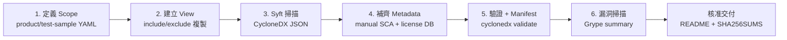

# MG51 BSP SBOM 產生計畫與產出物說明

> 依據 `doc/MS00_SBOM_提供說明.pptx`（MS00 SBOM 提供政策）與
> `doc/bsp_sbom_generation_guide.html`（BSP SBOM 產生指南），
> 針對 `bsp/MG51` 制定的 SBOM 產生計畫、執行流程與交付產出物說明。

---

## 1. 目標與原則（對應 MS00 政策）

- SBOM 不是單一 JSON，而是「元件透明度 + 漏洞管理 + 交付證據」的組合。
- 明確區分 **Product View（產品執行範圍）** 與 **Test Sample View（測試 / 建置範圍）**，
  避免把 non-runtime component 誤判成產品依賴。
- 採用 **CycloneDX 1.6 JSON** 作為主要客戶交付格式。
- 每份 SBOM 都需可追溯到來源 commit / tag、scope、工具版本與產生時間。
- 對外只交付 **approved export package**；內部保留完整 release evidence。

## 2. 產品基本資料

| 項目 | 值 |
| --- | --- |
| BSP 名稱 | `MG51`（SBOM 檔名前綴，來自 `--root` 目錄名） |
| 架構 | Nuvoton 8051（無 CMSIS） |
| 授權 | Apache-2.0 |
| 來源 commit | `5f20302`（2025-05-07） |
| 完整 commit | `5f20302ea21420485197f9c4faba1227fd7a2ca5` |
| 晶片家族 | `MG51xC9AE_MG51xB9AE_Series`、`MG51xD1AE_MG51xC1AE_Series` |

## 3. 前置作業（已完成）

已於 `bsp/MG51/Document/SBOM/` 建立 scope 定義：

```
bsp/MG51/Document/SBOM/
├── product-scope.yaml       # 產品 runtime 範圍（各家族 Library/Device,Startup,StdDriver）
├── test-sample-scope.yaml   # 測試 / 建置範圍（各家族 SampleCode/）
└── sbom_scope.md            # 給人閱讀的範圍說明
```

> `tools/gen_bsp_sbom.py` 會強制要求 `product-scope.yaml` 與
> `test-sample-scope.yaml` 存在於 `<bsp-root>/Document/SBOM/`，否則中止。

## 4. 工具環境需求

MS00 指南建議在 **Windows 11 + WSL2（Ubuntu 24.04）** 下執行。需安裝：

| 工具 | 用途 | 目前狀態（本機） |
| --- | --- | --- |
| `python3` | 執行 `gen_bsp_sbom.py` | ✅ 已安裝 |
| `git` | 取得版本（`git describe`） | ✅ 已安裝 |
| `syft` | 掃描目錄產生 CycloneDX | ❌ 未安裝 |
| `cyclonedx` CLI | 驗證 CycloneDX JSON | ❌ 未安裝 |
| `grype`（或 `trivy`） | 漏洞掃描 | ❌ 未安裝 |

WSL2 / Ubuntu 安裝範例：

```bash
# Syft
curl -sSfL https://raw.githubusercontent.com/anchore/syft/main/install.sh | sh -s -- -b /usr/local/bin
# Grype
curl -sSfL https://raw.githubusercontent.com/anchore/grype/main/install.sh | sh -s -- -b /usr/local/bin
# CycloneDX CLI
curl -sSfL -o /usr/local/bin/cyclonedx https://github.com/CycloneDX/cyclonedx-cli/releases/latest/download/cyclonedx-linux-x64
chmod +x /usr/local/bin/cyclonedx
```

## 5. 產生流程（六步，對應 MS00 Workflow）



| 步驟 | 動作 | 由誰執行 |
| --- | --- | --- |
| 1 | 定義 Scope（Product / TestSample YAML） | 已完成 |
| 2 | 依 include/exclude 建立 `Product_View/`、`TestSample_View/` | `gen_bsp_sbom.py` 自動 |
| 3 | Syft 掃描各 View → CycloneDX JSON | `gen_bsp_sbom.py` 自動 |
| 4 | 補 metadata：root component、目錄型 first-party 元件、binary license DB | `gen_bsp_sbom.py` 自動 |
| 5 | CycloneDX validate + 產生 Manifest（hash / scope / summary） | `gen_bsp_sbom.py` 自動 |
| 6 | Grype 對兩份 SBOM 產出漏洞報告 | `gen_bsp_sbom.py` 自動 |

## 6. 執行指令

於 `tools/` 目錄下執行（WSL2 / Ubuntu，工具齊備後）：

```bash
cd tools
python3 gen_bsp_sbom.py \
  --root ../bsp/MG51 \
  --database on \
  --scantool grype \
  --vtag
```

參數說明：

- `--root ../bsp/MG51`：BSP 根目錄；目錄名 `MG51` 會成為 SBOM 檔名前綴。
- `--database on`：啟用 `binary-license-database.json` 進行 binary license 補齊。
- `--scantool grype`：使用 Grype 做漏洞掃描（可改 `trivy`）。
- `--vtag`：於輸出檔名附加 git 版本（例如 `_5f20302`）；省略則不加版本後綴。

> 未安裝 `syft` / `cyclonedx` / `grype` 時，腳本會在對應步驟報錯中止。
> 本機目前僅具備 `python` 與 `git`，尚無法完成完整掃描與驗證。

## 7. 產出物（Deliverables）

執行後會在 `tools/<version>/`（例如 `tools/5f20302/`）產生一個自我完整、版本化的輸出資料夾：

```
tools/5f20302/
├── MG51_Product_SBOM_5f20302_cdx.json      # 產品 SBOM（CycloneDX 1.6）
├── MG51_TestSample_SBOM_5f20302_cdx.json   # 測試樣本 SBOM（CycloneDX 1.6）
├── MG51_SBOM_Manifest_5f20302.json         # Manifest 索引（非 SBOM，記錄 hash/scope/summary）
└── vulnerability-scan/
    ├── grype_MG51_Product_SBOM_5f20302_cdx.json
    └── grype_MG51_TestSample_SBOM_5f20302_cdx.json
```

（未加 `--vtag` 時檔名不含 `_5f20302` 版本後綴。）

| 產出物 | 說明 | 客戶可見性 |
| --- | --- | --- |
| Product SBOM | 產品 runtime first-party 元件、版本、license、依賴 | ✅ 交付 |
| Test Sample SBOM | 範例 / 建置資產，標示非 runtime dependency | ✅ 交付 |
| SBOM Manifest | 索引 included SBOM、scope、hash、component summary、客戶指引 | ✅ 交付 |
| Vulnerability scan | Grype 原始報告 | ⚠️ 內部保留；對外僅提供核准 summary |

## 8. 對客戶交付的 Package（受控 export）

依 MS00 政策，正式交付前組成 approved customer package：

```
MG51_SBOM_release_5f20302/
├── MG51_Product_SBOM_5f20302_cdx.json
├── MG51_TestSample_SBOM_5f20302_cdx.json
├── MG51_SBOM_Manifest_5f20302.json
├── README.md            # 產品、版本、來源 commit、工具版本、判讀限制
└── SHA256SUMS.txt       # 上述檔案的 SHA-256，供 sha256sum -c 驗證
```

- **通常不直接提供**：內部 repository access、raw vulnerability scan report、
  內部 generation scripts、尚未核准的 assessment record。
- **可依需求提供**（需 NDA / 合約 / compliance 核准）：scope YAML、
  vulnerability scan summary、manual component evidence。

## 9. 命名規則（MS00 Naming Rule）

- 檔名需包含 product/platform、SBOM type、release version 與格式副檔名。
- 避免 `latest`、`final`、`new`、`temp` 等模糊名稱。
- 不得覆寫舊 release evidence；需修正時建立 `<version>-r1` / `-r2`，
  並在 Manifest 記錄 `supersedes`、`reason` 與 `changeType`。

## 10. Release Gate 檢查清單

正式交付前確認以下皆存在且 checksum 驗證通過：

- [ ] Product SBOM
- [ ] Test Sample SBOM
- [ ] SBOM Manifest
- [ ] README.md
- [ ] SHA256SUMS.txt（`sha256sum -c SHA256SUMS.txt` 通過）
- [ ] Vulnerability scan report / summary
- [ ] PSIRT / QA / Compliance 完成 review

## 11. 保存與治理（MS00 Governance）

- Release evidence 存放於內部 evidence repository（SVN），與對外 package 分離。
- 每份 approved release evidence 至少保存：產品支援期 + 10 年。
- 核准後 evidence 不得覆寫（immutable）；修正走 revision directory。
